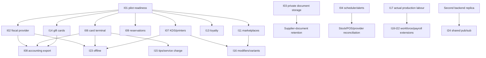

# Pending Integrations — Full Implementation Plan

> **Status:** Foundation implementation active. Core stock, labour costing and internal POS are implemented.
> This document covers every pending external, operational and cross-module integration
> currently listed in POS, stock and labour documentation.
>
> **Rule:** do not ship one “integration platform”. Select a real provider or operational
> need, implement its smallest reliable adapter, then extract shared code only after a
> second implementation proves the common contract.
>
> **Product decision:** Villa Carmen's internal POS is authoritative. Third-party POS
> ingestion (I12) is cancelled. Owner configuration and development handoffs live in
> `INTEGRATIONS_OWNER_AND_DEVELOPMENT_PLAN.md`.

---

## 1. Outcome

Complete production rollout and connect existing tenant-aware modules to required
external systems without weakening current guarantees:

- `restaurant_id` isolation on every row, lookup, callback and export.
- Integer cents for financial amounts.
- Append-only stock, refund, gift-card, loyalty and audit history.
- Idempotent commands and provider events.
- Successful payment is never repeated because a downstream integration failed.
- External provider failure never silently changes paid-ticket or stock history.
- No PAN, CVV, provider secret, payroll secret or private supplier document in logs.
- AI/search output remains advisory; VAT, payroll, fiscal and accounting changes require
  deterministic validation and human approval.

Core references:

- 📍 `../backend/internal/api/backoffice_pos_checkout.go:205` — atomic POS checkout.
- 📍 `../backend/internal/api/backoffice_pos_checkout.go:359` — refund/restock flow.
- 📍 `../backend/internal/api/backoffice_pos_admin.go:114` — POS health counters.
- 📍 `../backend/internal/api/backoffice_stock_reconciliation.go:35` — stock audit.
- 📍 `../backend/internal/api/backoffice_stock_reconciliation.go:44` — manual rebuild.
- 📍 `../backend/internal/api/backoffice_stock_documents.go:144` — OCR upload boundary.
- 📍 `../backend/internal/api/backoffice_labour_cost.go:274` — actual fichaje labour report.
- 📍 `../backend/internal/api/events.go:35` — existing best-effort n8n webhook delivery.
- 📍 `../backend/internal/db/migrations/065_pos_sales.sql:122` — provider-ready payment rows.
- 📍 `pages/app/pos/pos.tsx:35` — current operational POS UI.

---

## 2. Complete integration inventory

| ID | Integration | Priority | Start gate | Depends on |
|---|---|---:|---|---|
| I01 | POS pilot and production rollout | P0 | Pilot tenant + signed operating defaults | Core POS delivered |
| I02 | Fiscal/legal receipt provider: VeriFactu, TicketBAI or applicable jurisdiction | P0 | Jurisdiction review + provider contract | I01 |
| I03 | Private supplier-document object storage | P0 | **Implemented foundation**; production needs private Bunny credentials + retention approval | Existing OCR |
| I04 | Scheduled stock/POS/provider reconciliation and alerts | P0 | **Implemented foundation**; production needs timer install + alert URL | Existing audit endpoints |
| I05 | Authenticated POS Playwright and production-like load/concurrency environment | P0 | Staging stack + test session fixture | I01 |
| I06 | Physical card terminal and payment webhooks | P1 | Acquirer/provider selected | I01, provider sandbox |
| I07 | Kitchen display system and kitchen/bar printer routing | P1 | Station/device inventory | I01 |
| I08 | Accounting sales/VAT/stock export | P1 | **Deterministic CSV foundation implemented**; accountant approval/provider submission pending | I01, I02 decisions |
| I09 | Reservation auto-seat/no-show/visit synchronization | P1 | **Seat/open-visit foundation implemented**; served/no-show policy pending | I01 |
| I10 | Trusted jurisdiction-aware VAT research | P2 | Official/trusted source selected | Existing VAT CRUD |
| I11 | Delivery marketplace ingestion | P2 | First marketplace contract | I01, product mapping |
| I12 | External third-party POS ingestion | Cancelled | Internal Villa Carmen POS is authoritative | None |
| I13 | Loyalty accounts and points | P2 | Customer identity/consent policy | I01 |
| I14 | Gift cards/account credit | P2 | Accounting/liability policy | I01, I08 |
| I15 | Tips/service-charge allocation | P2 | Payroll/accounting/legal policy | I06, workforce rules |
| I16 | Ingredient-affecting modifiers and product variants | P2 | Real menu/channel requirement | POS catalogue/stock mappings |
| I17 | Actual recipe-production labour from fichaje/project time | P2 | **Post-shift admin allocation implemented**; kitchen pilot pending | Existing production + fichaje |
| I18 | Payroll export, payslips, taxes and Social Security provider | P3 | Payroll product/provider/legal contract | Compensation history |
| I19 | Overtime/night/holiday premiums | P3 | Effective-dated tenant policy + legal review | Fichaje + payroll scope |
| I20 | Paid leave, sickness and paid non-work time | P3 | Absence module policy | Fichaje + payroll scope |
| I21 | Multi-currency compensation | P3 | First multi-currency tenant | Payroll scope |
| I22 | Role-based/blended recipe labour fallback | P3 | Explicit tenant demand | Recipe labour |
| I23 | Offline multi-terminal command journal | P3 | Measured connectivity need + legal/provider approval | I02, I06, I07 |
| I24 | Shared WebSocket/pub-sub for multiple backend replicas | P3 | More than one live backend replica | Current in-process hubs |
| I25 | Barcode/QR and external counting-device integration | P3 | Device/format selected | Stock item catalogue |
| I26 | Supplier purchase-order/accounting integration | P3 | Supplier/accounting provider selected | Stock catalogue + I08 |

P0 means production safety or current documented blocker. P3 means conditional:
do not implement until its start gate becomes real.

---

## 3. Dependency order



Parallel safe work:

- I03 private storage and I04 scheduler can start immediately.
- I02 fiscal and I06 terminal may run in parallel after contracts, but each needs its
  own sandbox and webhook credentials.
- I07 KDS can start after kitchen routing is documented; it does not need fiscal work.
- I17 actual production labour is independent from POS provider work.

---

## 4. Shared integration rules

### 4.1 Local transaction versus external side effect

Keep current MySQL checkout transaction authoritative for local financial, stock and
cover state. External network calls do not run inside that transaction.

```text
Local command
  -> commit local immutable state
  -> persist provider work/event state
  -> call provider after commit
  -> accept signed callback or poll provider
  -> update provider status idempotently
  -> reconcile ambiguous states
```

Card-present payment is the one inverse flow:

```text
Create local payment attempt
  -> terminal captures payment
  -> signed webhook/poll marks attempt CAPTURED
  -> checkout transaction consumes captured attempt exactly once
  -> receipt/fiscal/KDS downstream work starts
```

A captured terminal payment with lost checkout response must be recoverable. Cashier
must see “payment captured; finalizing ticket”, never a button that can charge again.

### 4.2 No premature generic framework

- First fiscal provider: provider-specific package/tables if needed.
- First terminal provider: provider-specific adapter.
- First marketplace: provider-specific event mapping.
- Extract common adapter interfaces only when second provider is contracted.
- Existing `message_deliveries` remains suitable for best-effort n8n events, not for
  fiscal, payment or gift-card state machines.

### 4.3 Common provider-event requirements

Every financial/fiscal/channel callback must have:

- Tenant resolution independent from untrusted request JSON.
- Signature/timestamp verification before parsing business fields.
- Unique `(restaurant_id, provider, provider_event_id)` constraint.
- Raw payload hash; encrypted/raw payload retention only when contract requires it.
- Received, processed, failed and ignored states.
- Idempotent replay from admin tooling.
- Maximum body size and request timeout.
- No secret or full card data in error responses.

### 4.4 Credentials

- Platform-wide credentials: environment variables or deployment secret manager.
- Per-tenant credentials: encrypted secret reference, never plaintext API key in a
  general JSON settings column.
- Key rotation must permit old and new webhook secrets during a short overlap.
- Admin UI displays connection status and last four characters only when useful.
- Exported support bundles exclude credentials and private payloads.

### 4.5 Provider selection checklist

Do not start schema/code before recording:

1. Legal entity and supported jurisdiction.
2. Sandbox quality and test credentials.
3. API/webhook documentation and idempotency support.
4. Availability/SLA and support escalation.
5. Data residency and processor agreement.
6. Pricing per transaction/device/document.
7. Refund, cancellation and outage behavior.
8. Rate limits and reconciliation/report endpoints.
9. Credential model per platform versus per tenant.
10. Exit/export path if provider contract ends.

---

## 5. Wave 0 — Pilot and integration readiness

### Goal

Make current POS safely deployable before adding external providers.

### Product decisions

- Pilot tenant and named owner.
- Expected concurrent terminals and device/browser matrix.
- Dine-in/takeaway/delivery channels enabled for pilot.
- Service periods, timezone and cutoff.
- Shift requirement and cash opening/closing rules.
- Discount limits, refund roles and physical-restock roles.
- Receipt wording: **non-fiscal** until I02 passes legal acceptance.
- Top 20–30 products, VAT, stock rules and warehouse routing.
- Incident owner and support channel during pilot.

### Technical work

- Add active `pos_pack` only for pilot.
- Run authenticated Playwright against TLS backoffice with seeded tenant/session.
- Add load checks for concurrent line edits, checkout retry, shared stock items,
  refunds and exception replay.
- Test browser reload, response loss and WebSocket reconnect.
- Configure metrics/alerts from POS health, stock reconciliation and system logs.
- Document backup, migration, rollback and feature-disable commands.
- Run stock and covers in `SHADOW` for 1–2 weeks.
- Compare physical depletion, manual covers and provider-free cash/card reports.

### Required tests

- Two-tenant route and aggregate isolation.
- Concurrent duplicate checkout creates one payment and movement set.
- Lost response retry returns same ticket.
- Negative stock records anomaly without blocking sale.
- Split tickets close visit and count covers once.
- Refund bounds and optional `RETURN` remain idempotent.

### Exit

- Seven consecutive pilot days without unexplained duplicate payment/stock/cover.
- Mapping coverage agreed for pilot menu.
- All P0 alerts routed to a human.
- Written approval to enable covers `LIVE`, then stock `LIVE`.

### Rollback

Set stock `OFF` and covers `MANUAL`; keep tickets/payments immutable. Do not delete
POS rows or reverse stock except through explicit compensating movements.

---

## 6. I02 — Fiscal/legal receipt integration

### Gate

Jurisdiction-specific lawyer/accountant approval plus selected certified provider.
Do not infer VeriFactu/TicketBAI applicability from restaurant address alone.

### Domain

Add only after provider contract:

```text
pos_fiscal_documents
  restaurant_id, ticket_id/refund_id
  document_type: SALE | RECTIFICATION
  provider, local_sequence
  immutable_payload_json, payload_hash
  status: PENDING | SUBMITTING | ACCEPTED | REJECTED | CANCELLED
  provider_document_id, provider_status, qr_payload?
  submitted_at, accepted_at, last_error, attempt_count

pos_fiscal_provider_events
  restaurant_id, provider, provider_event_id
  signature_valid, payload_hash, status
  received_at, processed_at, error
```

Tenant-safe uniqueness:

- One active sale fiscal document per paid ticket.
- One rectification document per completed refund.
- One provider event per tenant/provider/event ID.

### Flow

1. Checkout commits paid ticket locally.
2. Immutable fiscal payload is built from ticket-line/VAT/payment snapshots.
3. Fiscal document enters `PENDING`.
4. Provider call occurs after commit.
5. Accepted provider identifiers/QR are stored without rewriting ticket totals.
6. Rejection marks fiscal state; sale remains paid and support action is required.
7. Refund creates provider-compliant rectification, never edits original fiscal row.

Whether submission must be synchronous, asynchronous or use a certified contingency
mode is a legal/provider decision. UI always separates `paymentStatus` from
`fiscalStatus`.

### API/UI

- `GET /api/admin/pos/tickets/{id}/fiscal`
- `POST /api/admin/pos/tickets/{id}/fiscal/retry`
- `GET /api/admin/pos/fiscal/queue`
- Provider webhook outside cookie auth, protected by provider signature.
- Receipt view displays “Pendiente de fiscalización”, “Aceptado” or “Rechazado”.
- “Factura/recibo fiscal” wording and QR appear only after approved acceptance rules.

### Tests

- Duplicate submit and duplicate callback create one accepted document.
- Ticket VAT buckets exactly equal immutable paid totals.
- Refund creates rectification; original document stays immutable.
- Provider outage never repeats payment.
- Cross-tenant provider references cannot resolve another tenant.
- Signature, stale timestamp and oversized-body rejection.
- Accepted document payload hash remains stable.

### Exit/rollback

Exit after provider certification/sandbox suite, accountant sample review and outage
drill. Rollback disables new submissions but preserves queue/history; never delete
accepted fiscal documents.

---

## 7. I06 — Physical card-terminal integration

### Gate

Provider/acquirer selected, sandbox terminal available, webhook signing documented.
No PAN/CVV enters browser, backend, logs or database.

### Domain

```text
pos_payment_attempts
  restaurant_id, ticket_id, terminal_key
  provider, provider_attempt_id
  requested_amount_cents, currency
  status: CREATED | SENT | AUTHORIZED | CAPTURED | DECLINED | CANCELLED | UNKNOWN
  idempotency_key, expires_at
  card_brand?, card_last4?
  created_by, created_at, updated_at

pos_payment_provider_events
  restaurant_id, provider, provider_event_id
  attempt_id, event_type, payload_hash
  status, received_at, processed_at, error
```

### Flow

1. Cashier selects card amount.
2. Backend creates idempotent attempt and calls terminal provider.
3. UI polls/receives server event; browser never trusts its own “approved” state.
4. Signed webhook or provider poll marks attempt `CAPTURED`.
5. Checkout consumes captured amount and writes current `pos_payments` provider fields.
6. `UNKNOWN` attempts block a second card attempt until provider reconciliation.
7. Provider-confirmed refund precedes local financial refund completion for card money.
8. Optional stock return occurs only after financial refund is confirmed.

### Split payment

Captured terminal attempts may cover part of ticket. Remaining cash/other amounts must
still sum exactly to ticket total inside checkout. Unused captured amounts require
void/refund workflow, never silent reassignment.

### API/UI

- `POST /api/admin/pos/tickets/{id}/payment-attempts`
- `GET /api/admin/pos/payment-attempts/{id}`
- `POST /api/admin/pos/payment-attempts/{id}/cancel`
- `POST /api/admin/pos/refunds/{id}/provider-submit`
- Provider webhook + scheduled reconciliation.
- UI states: waiting terminal, approved/finalizing, declined, unknown/reconcile.
- Manual “card recorded externally” remains separate and permission-gated fallback.

### Tests

- Duplicate create command sends one provider request.
- Duplicate/out-of-order callbacks converge to one final status.
- Captured attempt consumed by one checkout only.
- Timeout then late capture does not permit double charge.
- Split cash/card exactness.
- Refund retry creates one provider refund and one local refund.
- Secrets/PAN/CVV absent from logs and persisted payloads.

### Exit/rollback

Pilot one terminal and one cashier shift. Reconcile provider settlement against POS
for ten business days. Rollback disables integrated attempts; manual card recording
may remain, with outstanding `UNKNOWN` attempts resolved first.

---

## 8. I07 — KDS and printer routing

### Gate

Browser KDS is implemented internally. Owner must inventory real kitchen/bar stations
before production routing. Printer work remains gated by exact device/network/protocol
inventory; browser direct printing is not reliable multi-device routing.

### Domain

```text
pos_kitchen_stations
  restaurant_id, name, is_active, sort_order

pos_kitchen_routes
  restaurant_id, station_id
  category_id?/product_id?
  priority, is_active

pos_devices
  restaurant_id, station_id, device_key
  connection_type, status, last_seen_at

pos_kitchen_dispatches
  restaurant_id, visit_id, ticket_id
  sequence, status: PENDING | ACKNOWLEDGED | PREPARING | READY | FAILED | CANCELLED
  payload_hash, created_by, created_at

pos_kitchen_dispatch_lines
  restaurant_id, dispatch_id, ticket_line_id
  quantity_delta, action: ADD | VOID | NOTE | FIRE
  product/notes snapshots
```

### Flow

- Implemented explicit **Send to kitchen** boundary before payment.
- Dispatch immutable deltas, not mutable current-ticket state.
- Quantity increase sends `ADD`; decrease/void sends explicit `VOID` delta and reason.
- Product routing snapshots stations at dispatch time.
- Payment does not duplicate kitchen dispatch.
- Device retries use dispatch ID; printer/KDS acknowledges same ID once.
- Local agent opens outbound authenticated connection or polls; no inbound LAN port
  exposed to internet.

### UI

- Unsaved/sent/changed badges on ticket lines.
- Station routing settings and test print.
- Kitchen queue with elapsed time and acknowledge/ready states if KDS selected.
- Failed dispatch queue visible without blocking financial checkout.

### Tests

- One dispatch per command despite retries.
- Correct category/product routing.
- Edit after send produces delta, not duplicate full order.
- Void reaches all original stations.
- Device reconnect replays unacknowledged dispatch once.
- Tenant/device authentication isolation.

### Delivered / remaining exit

Delivered: internal KDS queue, station/category/product routing, immutable deltas,
idempotent commands and controlled status changes. Still required: configure real
stations, run beside paper process and document manual fallback. Printer agent remains
blocked until hardware inventory. Rollback leaves sales active and stops dispatch use.

---

## 9. I03 — Private supplier-document storage

### Gate

Private S3-compatible bucket or private Bunny storage zone selected. Existing public
pull zone must not contain originals.

### Storage rules

- Store private object key, never public URL.
- Encrypt at rest; TLS in transit.
- Tenant prefix plus random object ID; original filename is metadata only.
- Validate MIME from bytes, enforce current 10 MB limit and hash before upload.
- Signed download lifetime <= 10 minutes or backend-streamed authenticated download.
- Access audit records actor, document, action and timestamp.
- Configurable retention; default proposal: 7 years only if accountant/legal policy
  requires it, otherwise shorter tenant-approved period.
- Rejection/deletion uses tombstone/audit; confirmed accounting evidence follows legal
  retention rules.

### Existing schema use

`stock_document_scans.file_path` already exists at:

- 📍 `../backend/internal/db/migrations/062_stock_forecast_costing_ocr.sql:139`

Use it for private object key, not URL. Add metadata only when needed:

```text
storage_provider, storage_bucket, content_type, size_bytes
original_filename, retention_until, deleted_at
```

### Upload flow

1. Validate/hash request.
2. Check tenant duplicate hash.
3. Upload private original.
4. Send bytes to MiniMax extraction.
5. Persist extraction plus object key.
6. On DB failure, delete orphan object.
7. On AI failure, retain only if tenant policy says failed originals remain; otherwise
   delete immediately.

### API/UI

- `GET /api/admin/stock/documents/{id}/original` — authenticated short-lived access.
- `DELETE /api/admin/stock/documents/{id}/original` — policy/permission guarded.
- Document detail shows retention date and access history.

### Tests

- Public anonymous request cannot fetch object.
- Cross-tenant document access returns not found.
- Duplicate hash does not store second object.
- Failed DB transaction cleans uploaded object.
- Download URL expires.
- Delete/retention job records audit.

### Exit/rollback

Security review proves no public URL. Rollback stops new retention; existing private
objects remain governed by retention policy.

---

## 10. I04 — Scheduler, reconciliation and alerts

### Decision

Use systemd timers or cron. No queue framework needed. Refactor current handlers into
callable tenant-scoped functions, then invoke them from a small Go command. Do not
have cron log in through backoffice cookies.

### Jobs

| Job | Frequency | Default action |
|---|---:|---|
| Stock ledger ↔ level audit | Nightly | Detect and alert; never auto-rebuild initially |
| POS health scan | Every 5 minutes | Alert old visits/shifts, partial stock, anomalies |
| Covers reconciliation | Nightly | Detect differences; rebuild only under explicit policy |
| Fiscal pending/rejected reconciliation | Every 5 minutes | Poll/retry provider-safe states |
| Payment `UNKNOWN` reconciliation | Every 2–5 minutes | Poll provider; alert unresolved |
| Private-document retention cleanup | Daily | Delete only expired eligible objects |
| Integration event retry | Provider-specific | Bounded exponential retry |

### Implementation

- `cmd/ops-check` or equivalent small Go binary using existing DB config.
- MySQL named/advisory lock per job to prevent duplicate execution.
- Tenant iteration with context timeout and one tenant failure not stopping all others.
- Persist run summary: start/end, tenant, job, status, counts, error.
- Exit non-zero when alert threshold is crossed so systemd monitoring catches it.
- Rebuild stays separate from audit and requires explicit command/approval.

### Alerts

Minimum P0 alerts:

- Stock reconciliation difference.
- Paid ticket `PARTIAL` beyond threshold.
- Open stock exception/anomaly beyond threshold.
- Payment `UNKNOWN`.
- Fiscal `REJECTED` or stale `PENDING`.
- Open visit >12 hours; open shift >24 hours.
- Provider webhook signature failures spike.
- Private storage cleanup failure.

### Tests

- Two simultaneous runners: one acquires lock.
- Tenant failure isolation.
- Audit never mutates stock.
- Explicit rebuild verifies zero post-diff.
- Alert deduplication and recovery notification.

### Exit/rollback

Seven days of successful scheduled runs in staging/pilot. Rollback disables timers;
manual endpoints and reports remain available.

---

## 11. I08 — Accounting export and provider integration

### First rung: deterministic files

Start with accountant-approved CSV/XLSX exports before any accounting API:

- Daily sales journal by VAT rate.
- Payment-method settlement.
- Refund/rectification journal.
- Cash-shift differences.
- Stock purchase and valuation summary.
- Optional theoretical COGS; label as theoretical until accounting approves method.
- Labour-cost report separated from payroll liability.

Every export includes tenant, currency, business date, immutable source IDs and a
stable export version. Re-exporting same range produces same rows unless explicit
correction records exist.

### Provider phase

Only after a real accounting package is selected:

```text
accounting_exports
  restaurant_id, provider, period, export_type
  payload_hash, status, provider_reference
  attempt_count, last_error, exported_at

accounting_mappings
  restaurant_id, provider
  vat_rate_id/payment_method/stock_category
  external_account_code
```

Provider API submission is asynchronous and idempotent. Corrections create adjustment
entries; never rewrite previously accepted journals.

### Tests/exit

- VAT buckets sum to ticket net/tax/gross cents.
- Refund journals reverse correct buckets.
- Cash/card settlement matches POS reports/provider totals.
- Same period/version hash is stable.
- Accountant signs off two monthly closes before automated submission.

---

## 12. I10 — Trusted VAT research

### Gate

Select official tax authority dataset, paid legal-tax data provider or trusted search
API with stable source URLs. Generic AI model memory is not a source.

### Flow

1. User selects jurisdiction/date/product context.
2. Provider retrieves sources.
3. Optional AI summarizes returned text and extracts candidate rate/effective date.
4. Backend validates candidate range and stores citations/snapshot.
5. Admin reviews and explicitly applies to tenant VAT CRUD.
6. Existing products/recipes are not bulk-changed without separate preview/confirm.

### Domain

```text
stock_vat_research_reports
  restaurant_id, jurisdiction, query
  provider, source_urls_json, source_snapshot_hash
  candidate_rate, effective_from, summary
  status: DRAFT | ACCEPTED | REJECTED | EXPIRED
  created_by, reviewed_by, timestamps
```

### Tests

- No citation means no applicable recommendation.
- AI cannot call VAT mutation directly.
- Stale/effective-date warnings.
- Cross-tenant report isolation.
- Accepted rate still passes deterministic VAT CRUD validation.

---

## 13. I09 — Reservation synchronization

### Goal

Link one reservation to one dine-in visit without making reservation state or covers
ambiguous.

### Rules

- Tenant-safe reservation lookup only.
- Reservation party size prefills covers but remains editable before visit close.
- “Seat” creates/links one open visit idempotently.
- Existing linked visit is recovered in UI, not duplicated; one visit total per reservation.
- Closing visit may mark reservation served only under tenant-approved policy.
- No-show/cancel cannot close or refund a paid POS visit.
- Table changes update POS visit authority and reservation display without duplicate
  occupancy writes.

### Minimal schema/API

Use a tenant-safe link table if reservation IDs cannot be safely added to `pos_visits`:

```text
pos_visit_reservations
  restaurant_id, visit_id, booking_id
  linked_by, linked_at
  UNIQUE restaurant/visit
  UNIQUE restaurant/booking
```

Endpoints:

- Search eligible reservation from visit-open flow.
- Seat reservation idempotently.
- Unlink only before payment and with audit reason.
- Reconciliation report for seated reservation without visit and vice versa.

### Tests

Concurrent seat requests create one visit/link. Cross-date and cross-tenant booking
IDs cannot link. Split tickets still count reservation covers once through visit.

---

## 14. I11 — Delivery marketplaces

### Gate

First contracted marketplace and exact webhook/menu API documentation.

### Flow

- Signed webhook enters provider-specific inbox.
- Unique external order reference prevents duplicate order/ticket.
- Product/modifier mapping preview identifies unmapped lines.
- Accepted/paid provider order creates an external-source POS visit/ticket and uses
  current local finalization primitives.
- Delivery contributes zero covers.
- Stock deduction boundary must be explicit: default proposal is accepted paid order,
  not initial notification.
- Provider cancellation/refund creates local refund/compensation once.
- Menu availability/price sync is separate outbound phase after inbound stability.

### Domain

```text
marketplace_orders
  restaurant_id, provider, external_order_id
  status, financial_status, fulfillment_status
  raw_total_cents, commission_cents, currency
  pos_visit_id, pos_ticket_id
  payload_hash, received_at, updated_at

marketplace_product_mappings
  restaurant_id, provider, external_product_id
  pos_product_id, is_active
```

### Tests/exit

Duplicate/out-of-order events, unmapped products, cancellation after acceptance,
provider total mismatch, zero covers and exact stock idempotency. Pilot inbound only;
add menu sync after two weeks without duplicate orders.

---

## 15. I12 — External POS ingestion — cancelled

Villa Carmen's own POS is the only operational sales authority. Products, tickets,
payments, stock application, visits and covers remain in the backoffice database.

- Do not select an external POS provider.
- Do not build external POS ingestion.
- Do not extract a generic sale-adapter framework.
- Marketplace orders, when contracted, create tickets in the internal POS through the
  dedicated provider adapter described in I11.

---

## 16. I13–I15 — Loyalty, gift cards and tips

### Loyalty

Use append-only points ledger:

```text
loyalty_accounts
loyalty_point_movements: EARN | REDEEM | EXPIRE | ADJUST
```

Points post after paid ticket. Refund reverses earned points proportionally. Consent,
retention, customer merge and deletion policy required before collecting identity.

### Gift cards/account credit

Gift value is liability/payment, not ordinary discount:

```text
gift_accounts
  code_hash, status, currency, expires_at?
gift_movements
  ISSUE | REDEEM | REFUND | ADJUST
  amount_cents, ticket_id/refund_id, idempotency_key
```

Never store raw reusable gift code after issuance; store hash and show code once.
Redemption and checkout must share one DB transaction when gift ledger is local.

### Tips/service charge

Keep separate from ticket revenue and labour cost until legal/accounting policy exists:

```text
pos_gratuities
  ticket_id/payment_id, amount_cents, source
  allocation_status
pos_gratuity_allocations
  member_id, amount_cents, rule_snapshot
```

No automatic payroll export before I18. Refund behavior, VAT, employer costs and cash
handling require accountant/legal approval.

### Tests

Ledger balance, concurrent redemption, refund reversal, expiry, no negative gift
balance, tenant isolation, privacy erasure versus legally retained financial rows.

---

## 17. I16 — Modifiers and variants

This is not an external provider by itself, but it is required before complex KDS and
marketplace menus.

### Rules

- Variant remains a sellable SKU when price/VAT/stock behavior differs materially.
- Modifier group supports min/max selections.
- Ticket line snapshots modifier name, price and VAT.
- Ingredient-affecting modifier has explicit stock delta mapping.
- POS still deducts mapped finished/semi-finished outputs only; modifier mappings do
  not trigger recursive BOM explosion.
- Marketplace modifier IDs map to internal modifier IDs.

### Tests

Price/tax total, required selection, duplicate callback mapping, kitchen snapshot,
base-product stock plus modifier delta, refunds/restocks proportional to snapshots.

---

## 18. I17–I22 — Workforce and payroll integrations

### I17 actual recipe-production labour

Current costing uses standard member/minutes assignments. Add actual time only when
kitchen workflow is approved.

Preferred minimal model:

```text
member_time_allocations
  restaurant_id, time_entry_id, production_order_id
  minutes, allocation_type: PRODUCTION | OTHER
  created_by, created_at
```

Rules:

- Allocated minutes cannot exceed fichaje entry minutes.
- Compensation effective on work date calculates actual employer cost.
- Missing compensation stays explicit, never zero.
- Production order shows standard versus actual minutes/cost.
- Stock selector still exposes identity/cost availability, not salary details.

Start with post-shift admin allocation. Add production start/stop UI only if post-shift
allocation proves too costly.

### I18 payroll export/provider

Separate product boundary. First export approved payroll inputs; do not submit taxes,
payslips or Social Security until provider/legal contract exists.

Export fields: member external ID, ordinary hours, approved premium hours, paid
absence, gross inputs, tips/service charge and effective period. Salary details remain
admin-private and exports are access-audited.

### I19 premiums

Use effective-dated tenant policy snapshots. Do not build a generic legal rules engine
from assumptions. First supported rule set must come from an approved tenant contract:

- Night window.
- Holiday calendar source.
- Overtime threshold/period.
- Multiplier or fixed amount.
- Stacking priority.

### I20 absences

Add approved absence records before including paid non-worked hours in labour/payroll
reports. Absence cannot masquerade as worked fichaje time.

### I21 multi-currency

Defer until first tenant requires it. Add ISO currency to compensation period and
store conversion rate/source snapshot for reporting currency. Never mix currencies in
one total without explicit conversion date.

### I22 blended fallback

Defer until explicit-member recipe assignment is operationally insufficient. If added,
use effective-dated role rates and show `FALLBACK` in every cost result; never hide that
an actual member rate was unavailable.

### Tests

Allocation bounds/concurrency, historical rate selection, privacy gates, premium
boundary dates, holiday source snapshot, absence overlap and currency conversion
reproducibility.

---

## 19. I23 — Offline multi-terminal mode

### Gate

Implement last. Requires measured connectivity failures, terminal count, fiscal
contingency approval and payment-provider offline policy. Offline card capture is off
unless provider explicitly supports it.

### Client

- PWA service worker and IndexedDB command journal.
- Stable terminal ID and per-terminal monotonic command sequence.
- Cached catalogue/settings/permissions with version and expiry.
- Local open-ticket projection; server remains final authority after sync.
- Cash-only default offline checkout.

### Server

```text
pos_terminals
  restaurant_id, terminal_id, public_key/status, last_seen

pos_sync_commands
  restaurant_id, terminal_id, local_sequence
  command_id, command_type, payload_hash
  status: RECEIVED | APPLIED | CONFLICT | REJECTED
  server_entity_id, error
  UNIQUE restaurant/terminal/sequence
```

### Conflict rules

- Product price/VAT: server snapshot version decides; stale offline sale is flagged for
  review but paid cash is not deleted.
- Same table opened on two terminals: one visit wins; second requires supervised merge
  or converts to separate visit.
- Same line edited concurrently: command/version conflict; no last-write-wins on paid
  tickets.
- Receipt/fiscal handling follows approved contingency sequence.
- Stock applies once when server accepts sale; physical shortage never blocks sync.

### Tests

Multi-terminal partition, duplicate journal replay, reordered commands, stale catalogue,
same-table conflict, fiscal sequence recovery and browser storage corruption.

### Exit/rollback

Run controlled network-cut drills. Rollback disables new offline sessions; journaled
commands must sync or be explicitly resolved before clearing device storage.

---

## 20. I24 — Multi-replica WebSocket/pub-sub

Current hubs are process-local. Do nothing while backend runs one replica.

When second replica is required:

- Select shared pub/sub already available in deployment; Redis/NATS only then.
- Keep MySQL as source of truth; pub/sub carries invalidation/event notifications.
- Envelope: tenant, event ID, type, entity/version, occurred time.
- Subscribers ignore duplicate event IDs and refetch authoritative state.
- Presence/client counts are approximate; financial correctness never depends on pub/sub.
- Test replica loss, reconnect and duplicate delivery.

---

## 21. I25–I26 — Stock device, supplier and purchasing integrations

### Barcode/QR

- Use existing item SKU when unique per tenant.
- Add tenant barcode aliases only when multiple supplier/device codes exist.
- Scanner acts as keyboard input first; no SDK until hardware requires it.
- Count/receiving UI resolves barcode to item/unit and still requires quantity review.

### Supplier purchase orders

- Generate draft PO from deterministic reorder suggestions.
- Human reviews supplier, pack unit, price and delivery date.
- Provider/email submission records immutable sent snapshot.
- Receiving links invoice/OCR and purchase movements to PO lines.
- Partial receipt and substitution are explicit.

### Accounting purchasing

Export confirmed invoice/purchase movements and supplier references through I08 mapping.
Do not let accounting provider mutate stock ledger directly.

---

## 22. Observability

Common metrics:

```text
integration_request_total{provider,operation,status}
integration_request_duration_ms{provider,operation}
integration_event_total{provider,type,status}
integration_event_duplicate_total{provider,type}
integration_reconciliation_difference{provider,type}
integration_queue_age_seconds{provider,type}
pos_fiscal_document_total{status}
pos_payment_attempt_total{status}
pos_kitchen_dispatch_total{station,status}
stock_reconciliation_difference_count
private_document_storage_total{operation,status}
workforce_export_total{provider,status}
```

Logs include tenant ID, local entity ID, provider, operation, provider reference hash,
status and duration. Logs exclude secrets, session cookies, card data, private document
content, salary payloads and customer free text.

Recommended initial SLOs:

- Provider callback acknowledgement: <2 seconds p95 after signature/body validation.
- Duplicate callback side effects: zero.
- Fiscal/payment stale pending alert: within 5 minutes.
- KDS dispatch visible/printed: <3 seconds p95 on local healthy network.
- Nightly stock audit completion: <2 minutes per tenant.
- Private document unauthorized access: zero.

---

## 23. Security and compliance review

| Area | Required control |
|---|---|
| Payments | PCI scope documented; no PAN/CVV; signed callbacks; ambiguous capture reconciliation |
| Fiscal | Provider/legal approval; immutable payloads; retention; rectification workflow |
| Documents | Private storage; access audit; retention/deletion policy; DPA with AI/storage providers |
| Payroll | Least privilege; encrypted exports; access log; retention; no salary in stock APIs |
| Loyalty | Consent, purpose, erasure rules and financial-history exception |
| Webhooks | Signature, timestamp/replay window, body limit, unique event ID |
| Offline | Device registration/revocation, encrypted local storage where supported, short cache expiry |
| Multi-tenancy | Composite tenant keys plus cross-tenant integration tests |

Security review blocks production for I02, I03, I06, I13–I15, I18 and I23.

---

## 24. Test strategy

### Unit

- Provider state transitions.
- Signature/timestamp verification.
- Fiscal/VAT payload totals.
- Payment/refund amount reconciliation.
- Kitchen dispatch deltas/routing.
- Gift/loyalty ledger balances.
- Workforce allocation/premium calculations.

### Real MySQL integration

- Tenant-safe unique provider references.
- Duplicate and out-of-order events.
- Concurrent checkout/provider callback.
- Captured payment consumed once.
- Fiscal/refund append-only behavior.
- Scheduled job lock and tenant failure isolation.
- Private document metadata/object cleanup compensation.

### Contract

Store sanitized provider fixtures for every documented callback/state. Run against
sandbox in CI only when stable credentials and provider limits permit it; otherwise run
fixture contract tests on every change and nightly sandbox smoke tests.

### React/Vitest

- Payment waiting/unknown/recovery states.
- Fiscal pending/rejected receipt labels.
- KDS failed dispatch and retry.
- Private-document download/delete permission states.
- Provider setup/health screens.
- No salary/secret leakage.

### Playwright

- Authenticated pilot sale through checkout and receipt.
- Terminal approval callback simulation.
- Fiscal accepted/rejected callback simulation.
- Kitchen dispatch send/edit/void.
- Network loss/reload recovery.
- Cross-role hidden/disabled actions.

---

## 25. Rollout waves

| Wave | Scope | Exit |
|---|---|---|
| 0 | I01 + I05 pilot readiness | Shadow/live sign-off |
| 1 | I03 private storage + I04 scheduler | Security review + seven stable days |
| 2A | I02 fiscal | Legal/provider acceptance |
| 2B | I06 terminal | Settlement reconciliation sign-off |
| 3 | I07 KDS/printers + I09 reservations | Two weeks operational stability |
| 4 | I08 accounting + I10 VAT research + I17 production labour | Accountant/ops sign-off |
| 5 | I11 first marketplace | First marketplace stable in internal POS |
| 6 | I13–I16 customer/menu extensions | Privacy/accounting approval |
| 7 | I18–I22 payroll/workforce | Separate product/legal approval |
| 8 | I23 offline + I24 multi-replica | Measured need and failure drills |
| 9 | I25–I26 stock devices/purchasing | Supplier/device contract |

Never enable two high-risk financial providers for all tenants simultaneously. Pilot
one tenant/provider/device, then expand by feature flag.

---

## 26. Definition of done

Each integration is done only when:

- [ ] Provider/legal/product start gate is recorded.
- [ ] Tenant-scoped schema and permissions exist.
- [ ] Idempotent command/event contract exists.
- [ ] External outage and ambiguous state have documented behavior.
- [ ] Reconciliation endpoint/job exists for financial/fiscal integration.
- [ ] Secrets and private payloads are absent from logs.
- [ ] Cross-tenant, duplicate, retry and out-of-order tests pass.
- [ ] Admin health/status and manual recovery path exist.
- [ ] Rollback disables new work without deleting immutable history.
- [ ] Backoffice JSX/type/lint/unit/build validation passes.
- [ ] Real MySQL migration/integration validation passes.
- [ ] Pilot owner signs acceptance criteria.
- [ ] Support runbook names alert owner and escalation path.

---

## 27. Recommended commit sequence

Do not combine providers or unrelated integrations in one commit series.

1. `docs(integrations): approve provider and operational contract`
2. `test(integration): add provider fixtures and failing state tests`
3. `db(integration): add tenant event and state schema`
4. `feat(integration): add provider client and signature validation`
5. `feat(integration): add idempotent callback and reconciliation`
6. `feat(integration-ui): add setup health and recovery states`
7. `test(integration): add mysql concurrency and browser flow`
8. `ops(integration): add secrets timers metrics and alerts`
9. `docs(integration): add rollout rollback and support runbook`

Use next available migration number when work starts. Do not reserve empty migrations
for every item in this plan.

---

Operations/deployment runbook for delivered foundations: `INTEGRATIONS_OPERATIONS_RUNBOOK.md`.

Owner configuration and internal development backlog: `INTEGRATIONS_OWNER_AND_DEVELOPMENT_PLAN.md`.

## 28. Immediate next actions

1. Name pilot tenant and integration owner.
2. Complete Wave 0 authenticated E2E/load/shadow rollout.
3. Configure separate private Bunny credentials and approve retention period.
4. Build/install `ops-check`; route and test `operations.warning` alerts.
5. Ask accountant to approve delivered CSV columns before provider submission work.
6. Pilot reservation seating and actual production-labour allocation with separate owners.
7. Obtain jurisdiction-specific fiscal opinion and select certified provider.
8. Select card-terminal provider only after fiscal/payment operating flow is signed.
9. Inventory kitchen/bar stations and printers for I07.
10. Leave offline, generic adapters and shared pub/sub untouched until their gates fire.
