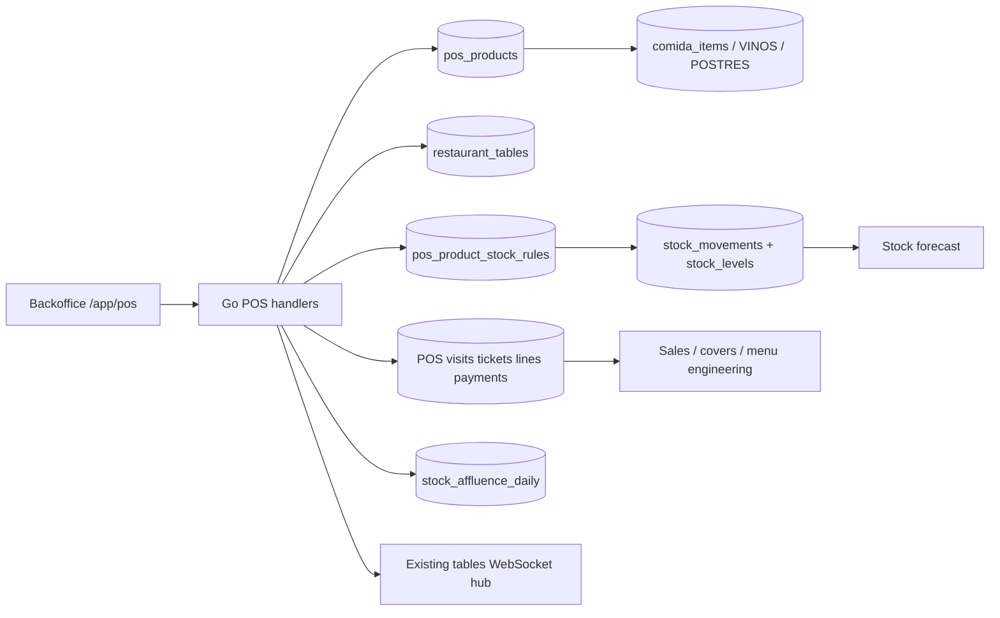

# POS Module — Full Implementation Plan

> **Status:** Core implementation delivered and validated. This document preserves original design and implementation checklist; current rollout/deferred status lives in `POS_IMPLEMENTATION_STATUS.md`.
> **Primary outcome:** paid POS tickets create idempotent `SALE` stock movements;
> closed dine-in visits create automatic, non-duplicated covers for forecasting.
> **Implementation rule:** financial close, stock application and automatic-cover
> update use one MySQL transaction whenever all affected data is local.

---

## 1. Scope

### Included

- Multi-tenant restaurant POS under existing `restaurant_id` architecture.
- Dine-in, takeaway and delivery channels; dine-in is first pilot path.
- Existing restaurant table-map integration.
- Existing booking link and party-size prefill.
- Sellable POS catalogue imported from existing Carta data or created manually.
- Product prices, tenant VAT, discounts and immutable sale snapshots.
- Visits, tickets, ticket lines, split payments and manual cash/card/other methods.
- Table occupancy, open-ticket recovery and real-time table updates.
- Product-to-stock mappings with warehouse routing.
- Automatic stock deductions on successful ticket checkout.
- Automatic covers once per closed dine-in visit, including split-ticket safety.
- Voids, refunds, optional physical restock and append-only audit history.
- Mapping-gap diagnostics, shadow mode, reconciliation and replay.
- Fine-grained POS permissions and subscription gating.
- Backoffice POS UI, settings, stock-readiness screen and operational reports.
- Unit, integration, concurrency, React and Playwright coverage.

### Explicit non-goals for first production release

- Card processor or physical payment-terminal integration.
- Storage of PAN, CVV or full payment-card data.
- Certified fiscal printer, VeriFactu, TicketBAI or jurisdiction-specific tax filing.
- Offline-first conflict resolution across multiple terminals.
- Delivery marketplace integrations.
- Customer loyalty, gift cards or account credit.
- Payroll, tips distribution or service-charge payroll treatment.
- Automatic raw-material production when a dish is sold.
- Kitchen display system, printer routing and course firing beyond basic line state.

These are separate integrations. Core POS schema keeps stable provider references and
statuses so they can be added later without rewriting paid-ticket history.

---

## 2. Confirmed repository baseline

| Existing capability | Reuse | Reference |
|---|---|---|
| Tenant key and cookie auth | Every POS row/query uses `restaurant_id`; admin routes use `bo_session` | 📍 `../backend/internal/api/server.go:79` |
| Section RBAC | Add `pos` section; keep granular POS permissions below section gate | 📍 `../backend/internal/api/backoffice_rbac.go:12` |
| Recurring feature subscriptions | Gate POS with `feature_key='pos_pack'` | 📍 `../backend/internal/db/migrations/018_backoffice_premium_features.sql:52` |
| Restaurant areas/tables | Reuse table IDs and map; POS does not create duplicate tables | 📍 `../backend/internal/db/migrations/018_backoffice_premium_features.sql:20` |
| Runtime table status + WebSocket hub | Derive occupied state from open POS visits; broadcast existing table events | 📍 `../backend/internal/db/migrations/032_restaurant_tables_runtime_fields.sql:1` · 📍 `../backend/internal/api/backoffice_premium.go:2488` |
| Existing table-map UI | Open/restore POS visit from selected table | 📍 `pages/app/reservas/tables/tables.tsx:1` |
| Carta catalogue | Import/sync sellable products; ticket lines always keep snapshots | 📍 `../backend/internal/db/migrations/018_comida_items_and_plato_categories.sql:37` · 📍 `../backend/internal/api/comida.go:453` |
| Technical recipes/BOM | Mapping may reference recipe output for costing, but sale never explodes raw BOM | 📍 `../backend/internal/api/backoffice_stock_recipes.go:421` |
| Append-only stock ledger | POS writes `SALE`; refunds with physical restock write `RETURN` | 📍 `../backend/internal/db/migrations/060_stock_control.sql:128` |
| Deduction source | POS rejects mappings to `PRODUCTION`-only items, preventing double deduction | 📍 `../backend/internal/db/migrations/060_stock_control.sql:72` · 📍 `../backend/internal/api/backoffice_stock.go:1280` |
| Manual covers and forecast | POS becomes authoritative only after covers mode changes to `LIVE` | 📍 `../backend/internal/db/migrations/062_stock_forecast_costing_ocr.sql:1` · 📍 `../backend/internal/api/backoffice_stock_analytics.go:172` |
| Sidebar route model | Add `/app/pos` and icon through existing RBAC filtering | 📍 `lib/rbac.ts:3` · 📍 `ui/shell/Sidebar.tsx:11` |

### Current gaps

- No visit/order/ticket/payment tables.
- No unified POS sellable catalogue.
- No product-to-stock mapping.
- No authoritative moment that means “sale completed”.
- No automatic cover source beyond manual `stock_affluence_daily` input.
- No receipt numbering, cashier shift or refund workflow.
- Existing `restaurant_tables.status` is not sufficient transaction history.

---

## 3. Default product decisions

Implementation can start with these defaults. Product owner may override before
Phase 1 without changing architecture.

| Decision | Default |
|---|---|
| Stock deduction moment | Successful ticket checkout/payment finalization |
| Cover unit | One guest in one dine-in visit; never one guest per split ticket |
| Cover finalization | Visit closes after all tickets are settled and table is released |
| Price semantics | Gross price including VAT |
| Money arithmetic | Integer cents in Go and POS tables; never `float64` for money |
| Business timezone | Tenant-configurable IANA zone; initial default `Europe/Madrid` |
| Business-day cutoff | Tenant-configurable; initial default `05:00` |
| Service periods | Configurable `LUNCH`, `DINNER`, `OTHER`; snapshotted at visit open |
| Negative stock at POS | Sale completes and may produce negative stock; service is never blocked after consumption |
| Missing stock mapping | Ticket closes; exception is recorded; admin maps and replays later |
| Paid-ticket edits | Forbidden; correction uses refund/compensating records |
| Financial refund | Does not restock by default |
| Physical restock | Explicit authorized choice; writes `RETURN` movement |
| Recipe sale behavior | Deduct mapped finished/semi-finished output only; never explode raw recipe at sale |
| Product variants | Separate sellable SKU/product in MVP; generic variant engine deferred |
| Card payments | Record externally completed card amount; no card data stored |
| Offline | Online-only MVP with retry-safe commands and recoverable open tickets |
| POS feature plan | `pos_pack`; stock integration additionally needs stock module enabled |

---

## 4. Architecture



### Core rule

Internal POS and stock live in the same backend and DB. Do not add Kafka, Redis,
an outbox or a queue for the core checkout path. One local transaction is shorter,
safer and recoverable through idempotency.

Extract provider interfaces only when a second POS/payment provider exists. Until
then use small application functions:

```text
finalizePOSTicket(tx, tenant, ticket, checkoutCommand)
applyPOSTicketStock(tx, tenant, ticket)
rebuildPOSAffluenceKey(tx, tenant, serviceDate, serviceType)
```

---

## 5. Domain model and migrations

Use migrations `064`–`066`. All tables carry `restaurant_id`; every relationship
is tenant-safe; indexes start with `restaurant_id`.

### 5.1 Migration `064_pos_catalog_and_settings.sql`

#### `pos_settings`

```text
restaurant_id PK
is_enabled
stock_mode: OFF | SHADOW | LIVE
covers_mode: MANUAL | SHADOW | LIVE
timezone                    -- IANA string
business_day_cutoff         -- TIME, default 05:00
auto_close_visit            -- close when final ticket settles
require_open_shift
receipt_prefix
updated_at
```

Rules:

- New tenants start `stock_mode=OFF`, `covers_mode=MANUAL`.
- Enabling `LIVE` requires explicit admin confirmation.
- `SHADOW` computes and stores expected results without mutating stock/affluence.
- No settings row means POS disabled.

#### `pos_service_periods`

```text
id, restaurant_id
name
service_type: LUNCH | DINNER | OTHER
start_time, end_time         -- may cross midnight
sort_order, is_active
created_at, updated_at
UNIQUE (restaurant_id, name)
```

Resolution:

1. Convert timestamp into tenant timezone.
2. Apply business-day cutoff to derive `service_date`.
3. Match configured period.
4. Use `OTHER` if no period matches.
5. Snapshot date/type on visit; later config changes do not rewrite history.

#### `pos_product_categories`

```text
id, restaurant_id
name, sort_order, is_active
UNIQUE (restaurant_id, name)
```

#### `pos_products`

```text
id, restaurant_id, category_id?
name, description?
source_type: COMIDA_ITEM | VINO | POSTRE | MENU_DISH | MANUAL
source_id?                  -- source row ID; null for manual
sku?
price_gross_cents
vat_rate_id?                -- reuse current tenant VAT registry
is_active
version
created_at, updated_at, deleted_at
UNIQUE (restaurant_id, source_type, source_id)
UNIQUE (restaurant_id, sku)
```

Rules:

- Source import is one-way into POS product data.
- Admin chooses whether later source changes update POS name/price.
- Paid ticket lines never depend on current product data; snapshots preserve truth.
- Delete is soft. A product used by ticket history cannot be physically deleted.

#### `pos_product_stock_rules`

```text
id, restaurant_id, pos_product_id
stock_item_id
stock_recipe_id?            -- costing/reference only
warehouse_id
qty_base_per_sale
sort_order, is_active
version
created_at, updated_at
UNIQUE (restaurant_id, pos_product_id, stock_item_id, warehouse_id, version)
```

Supports one product deducting multiple sale items, e.g. a combo with bottled drink.

Mapping validation:

- Product, stock item, recipe and warehouse belong to same tenant.
- `qty_base_per_sale > 0`.
- Stock item is active.
- Stock item `deduction_source` is `SALE` or `BOTH_MANUAL`; `PRODUCTION` is rejected.
- If `stock_recipe_id` is supplied, recipe output item equals `stock_item_id`.
- Non-tracked item is allowed but shown as “not deducted”.
- Warehouse is active; product can route bar items to bar warehouse and food to kitchen.

#### `pos_role_permissions`

```text
restaurant_id, role_slug, permission_key, is_allowed, updated_at
PK (restaurant_id, role_slug, permission_key)
```

Use same exact-gate pattern as stock permissions.

### 5.2 Migration `065_pos_sales.sql`

#### `pos_shifts`

```text
id, restaurant_id
terminal_key
opened_by, closed_by?
opening_cash_cents
closing_cash_counted_cents?
expected_cash_cents?
status: OPEN | CLOSED
opened_at, closed_at?
notes?
open_terminal_key GENERATED for unique open shift
UNIQUE (restaurant_id, open_terminal_key)
```

Cash shifts are required only when `pos_settings.require_open_shift=1`.

#### `pos_visits`

Represents one party/service occasion. Covers live here, not on tickets.

```text
id, restaurant_id
channel: DINE_IN | TAKEAWAY | DELIVERY
table_id?
booking_id?
service_date
service_type: LUNCH | DINNER | OTHER
covers
status: OPEN | CLOSED | CANCELLED
opened_by, closed_by?
opened_at, closed_at?
version
open_table_id GENERATED WHEN DINE_IN + OPEN
created_at, updated_at
UNIQUE (restaurant_id, open_table_id)
```

Rules:

- Dine-in requires active table and `covers > 0`.
- Takeaway/delivery use `covers=0` and no table.
- Booking link prefills covers from reservation but value remains editable while open.
- One table may have only one open visit.
- Table transfer updates visit table with audit; covers stay on visit.
- Closed visit is immutable; post-close cover corrections use adjustments.

#### `pos_tickets`

One visit may own multiple tickets, enabling future bill splitting without cover duplication.

```text
id, restaurant_id, visit_id, shift_id?
ticket_number
status: OPEN | PAID | VOIDED | PARTIALLY_REFUNDED | REFUNDED
subtotal_gross_cents
discount_cents
tax_cents
total_gross_cents
paid_cents
refunded_cents
stock_status: NOT_APPLICABLE | SHADOW | COMPLETE | PARTIAL | REVERSED
checkout_idempotency_key?
opened_by, closed_by?
opened_at, paid_at?, voided_at?
version
created_at, updated_at
UNIQUE (restaurant_id, ticket_number)
UNIQUE (restaurant_id, checkout_idempotency_key)
```

#### `pos_ticket_lines`

```text
id, restaurant_id, ticket_id, pos_product_id?
product_name_snapshot
product_sku_snapshot?
quantity DECIMAL(12,3)
unit_price_gross_cents
vat_rate_snapshot DECIMAL(5,2)
discount_cents
line_total_gross_cents
notes?
course?
status: ACTIVE | VOIDED
void_reason?
idempotency_key
created_by, voided_by?
created_at, updated_at, voided_at?
UNIQUE (restaurant_id, idempotency_key)
```

Rules:

- Client supplies product, quantity and command ID; server supplies price/VAT.
- Authorized override price is a separate explicit command with reason.
- Server recalculates totals after every mutation.
- Paid ticket lines cannot be edited or deleted.
- Zero-priced complimentary lines still deduct stock when paid.

#### `pos_payments`

```text
id, restaurant_id, ticket_id
method: CASH | CARD | BANK | OTHER
amount_cents
status: CAPTURED | VOIDED | REFUNDED
provider?
provider_reference?
card_last4?                 -- optional; never full PAN
idempotency_key
received_by
received_at
UNIQUE (restaurant_id, idempotency_key)
UNIQUE (restaurant_id, provider, provider_reference)
```

#### `pos_refunds`

```text
id, restaurant_id, ticket_id
amount_cents
reason
payment_method
provider_reference?
status: COMPLETED | VOIDED
idempotency_key
created_by, created_at
UNIQUE (restaurant_id, idempotency_key)
```

#### `pos_refund_lines`

```text
id, restaurant_id, refund_id, ticket_line_id
quantity DECIMAL(12,3)
amount_cents
restock_requested
reason
```

#### `pos_audit_events`

```text
id, restaurant_id
entity_type, entity_id
action
before_json?, after_json?
actor_user_id
created_at
INDEX (restaurant_id, entity_type, entity_id, created_at)
```

Audit actions include visit open/transfer/close/cancel, line add/change/void,
discount, checkout, payment, refund, restock and cover correction.

#### `pos_daily_sequences`

```text
restaurant_id, business_date, sequence_type, next_value
PK (restaurant_id, business_date, sequence_type)
```

Used transactionally for readable ticket numbers; UUIDs remain idempotency keys.

### 5.3 Migration `066_pos_stock_and_covers.sql`

#### `pos_ticket_line_stock`

Immutable stock-consumption snapshot generated at checkout.

```text
id, restaurant_id
ticket_id, ticket_line_id
stock_rule_id?
stock_item_id
warehouse_id
quantity_sold
qty_base_planned
status: SHADOW | APPLIED | SKIPPED_UNTRACKED | ERROR | REVERSED
sale_movement_id?
return_movement_id?
error_code?, error_message?
created_at, applied_at?, reversed_at?
UNIQUE (restaurant_id, ticket_line_id, stock_item_id, warehouse_id)
```

This table makes mapping changes harmless to historical tickets and gives refunds
an exact original consumption snapshot.

#### `pos_stock_exceptions`

```text
id, restaurant_id
ticket_id, ticket_line_id?
code: UNMAPPED_PRODUCT | INVALID_MAPPING | WAREHOUSE_MISSING | APPLY_FAILED
status: OPEN | RESOLVED | IGNORED
message
resolved_by?, resolved_at?
replay_idempotency_key?
created_at
INDEX (restaurant_id, status, created_at)
```

#### `pos_cover_adjustments`

Append-only correction after visit close.

```text
id, restaurant_id
visit_id?
service_date
service_type
delta_covers                 -- signed non-zero integer
reason
actor_user_id
created_at
INDEX (restaurant_id, service_date, service_type)
```

No new automatic-cover aggregate table is needed. `stock_affluence_daily` already
supports `source='POS'`. Rebuild from closed visits plus adjustments.

---

## 6. Critical transactional flows

### 6.1 Open dine-in visit

1. Authenticate session; require `pos.sell`.
2. Validate POS entitlement and active tenant.
3. Resolve tenant local time, business date and service period.
4. Validate active table belongs to tenant.
5. If booking supplied, validate tenant and prefill party size.
6. Require covers `> 0`.
7. Insert visit using unique open-table constraint.
8. Create first open ticket.
9. Broadcast `pos_visit_opened` through existing tenant table hub.
10. Return visit + ticket snapshots.

Concurrent opens for same table: one succeeds; second receives `409 TABLE_OCCUPIED`
and current visit ID.

### 6.2 Add/update/void ticket line

1. Lock ticket row.
2. Reject non-open ticket.
3. Validate optimistic `version`.
4. Load active POS product and server price/VAT.
5. Insert or update line using client idempotency key.
6. Recalculate integer-cent totals server-side.
7. Append audit event.
8. Increment ticket version.

Voiding before checkout writes no stock movement. Reason and actor are mandatory.

### 6.3 Checkout and stock deduction

`POST /api/admin/pos/tickets/{id}/checkout` is the authoritative sale boundary.

Input:

```json
{
  "idempotencyKey": "uuid",
  "expectedVersion": 8,
  "payments": [
    { "method": "CASH", "amountCents": 3000, "idempotencyKey": "uuid" },
    { "method": "CARD", "amountCents": 1540, "idempotencyKey": "uuid", "providerReference": "optional" }
  ],
  "closeVisit": true
}
```

Transaction:

1. Lock ticket and visit.
2. Existing same checkout ID → return stored paid result.
3. Reject stale version or non-open ticket.
4. Reload active lines; recalculate subtotal, discounts, VAT and total.
5. Validate captured payment sum equals total.
6. Insert payment rows.
7. Snapshot each line’s active stock rules into `pos_ticket_line_stock`.
8. `stock_mode=OFF`: mark `NOT_APPLICABLE`; no stock work.
9. `stock_mode=SHADOW`: mark snapshots `SHADOW`; no ledger mutation.
10. `stock_mode=LIVE`:
    - unmapped line → exception + ticket `PARTIAL`; checkout continues;
    - untracked item → `SKIPPED_UNTRACKED`;
    - mapped tracked item → prepare `SALE` movement;
    - reject impossible `PRODUCTION` mapping as exception, never double deduct;
    - sort `(warehouse_id, stock_item_id)` before row locking to reduce deadlocks;
    - create/lock `stock_levels` rows;
    - append negative `SALE` movements;
    - update materialized levels;
    - POS sale may cross below zero; record negative-stock anomaly, do not block checkout.
11. Mark ticket `PAID`, immutable, with final monetary snapshots.
12. If `closeVisit=true` and all visit tickets are settled:
    - mark visit `CLOSED`;
    - if covers mode `LIVE`, recompute that date/service key;
    - update `stock_affluence_daily` with `source='POS'`;
    - release table occupancy.
13. Append audit events.
14. Commit.
15. Broadcast paid-ticket, visit and table-state events.

Stock idempotency key:

```text
pos-ticket:{ticketId}:line-stock:{snapshotId}:sale
```

`stock_movements.ref_type='pos_ticket_line_stock'`, `ref_id=snapshot.id`.

### 6.4 Recipe and direct-sale deductions

| POS mapping | Checkout action |
|---|---|
| Finished recipe dish | Deduct mapped recipe output stock item by configured base quantity |
| Semi-finished portion | Deduct mapped semi-finished output quantity |
| Bottle/can/water | Deduct direct stock item |
| Coffee or measured spirit | Deduct mapped sale item quantity in g/ml/ud |
| Raw ingredient marked `PRODUCTION` | Mapping rejected; raw stock must move through production |
| Non-tracked item | Snapshot as skipped; no stock movement |
| No mapping | Close sale, create exception, allow later replay |

POS never recursively explodes recipe components. Production already deducted raw
goods; recursive sale explosion would create the critical double-deduction bug.

### 6.5 Automatic covers

Covers belong to `pos_visits`, not tickets.

```text
POS covers for key =
  SUM(covers of CLOSED DINE_IN visits for service_date + service_type)
  + SUM(pos_cover_adjustments.delta_covers for same key)
```

Rebuild function:

```sql
INSERT INTO stock_affluence_daily (..., covers, source)
VALUES (..., computed_covers, 'POS')
ON DUPLICATE KEY UPDATE covers=VALUES(covers), source='POS';
```

Rules:

- Split tickets do not multiply covers.
- Takeaway and delivery always contribute zero.
- Cancelled visits contribute zero.
- Table transfer does not change covers.
- Open visits do not contribute until closed.
- Covers mode `SHADOW` shows comparison but does not overwrite manual data.
- Covers mode `LIVE` makes POS authoritative for keys with POS activity.
- Existing manual stock-affluence endpoint returns `409 POS_COVERS_AUTHORITATIVE`
  for a POS-owned key; correction must use POS adjustment with reason.
- Reconciliation endpoint recomputes any date range from visits + adjustments.

### 6.6 Refund and optional restock

Financial refund is not proof product returned to usable stock.

1. Require `pos.refund`.
2. Lock paid ticket; validate refundable quantities/amount.
3. Insert refund + refund lines and update paid/refunded totals.
4. If `restockRequested=false`: no stock movement.
5. If true:
   - require `pos.restock`;
   - read original `pos_ticket_line_stock` snapshot;
   - append positive `RETURN` movement for proportional quantity;
   - use original warehouse/item, not current mapping;
   - mark snapshot reversed only when full quantity returned.
6. Never delete/update original `SALE` movement.

Food already served should normally remain non-restocked. Packaged unopened products
are the likely restock case.

### 6.7 Mapping replay

For historical unmapped lines:

1. Admin creates valid product stock rule.
2. Preview affected exception count and quantities.
3. Authorized replay selects date/tickets and supplies one idempotency key.
4. Lock unresolved exceptions.
5. Snapshot selected current mapping with `replayed_at` audit context.
6. Apply missing `SALE` movements exactly once.
7. Resolve exceptions and recompute ticket stock status.

Replay never changes financial data or covers.

---

## 7. Catalogue integration

### 7.1 Import sources

- `comida_items`: platos, bebidas, cafes.
- `VINOS`: wines.
- `POSTRES`: desserts where price exists.
- `menu_dishes_catalog`: reusable group-menu dishes.
- Manual POS-only products.

### 7.2 Import workflow

1. Show source candidates and current POS products.
2. Match by `(source_type, source_id)`, never name alone.
3. Preview create/update/unchanged rows.
4. Select fields to sync: name, description, price, active state.
5. Confirm atomically.
6. Preserve stock mappings across source refresh.
7. Never mutate paid ticket snapshots.

### 7.3 Stock readiness

Each POS product shows:

- Mapping status: complete / unmapped / invalid / untracked.
- Warehouse.
- Quantity consumed per sale in display and base units.
- Recipe/output reference.
- Current theoretical on-hand.
- Last successful deduction.
- Open mapping exceptions.

Readiness summary:

```json
{
  "activeProducts": 118,
  "mappedProducts": 105,
  "unmappedProducts": 9,
  "untrackedProducts": 4,
  "invalidMappings": 0,
  "salesCoveragePct": 88.9
}
```

Coverage should also be weighted by shadow sales volume. Mapping 90% of products
is weak if missing products represent 40% of sales.

---

## 8. Permissions and entitlement

### 8.1 Section

Add `pos` to backend/frontend section enums and sidebar.

### 8.2 Granular permissions

```text
pos.view
pos.sell
pos.visit.manage
pos.line.void
pos.discount
pos.checkout
pos.refund
pos.restock
pos.shift.manage
pos.catalog.manage
pos.stock_mapping.manage
pos.covers.adjust
pos.reports.view
pos.settings.manage
```

Defaults:

- `root`, `admin`: all POS permissions.
- Other roles: no automatic grants in migration.
- Pilot admin explicitly grants `view/sell/checkout` to floor roles.
- Refund, restock, cover correction and settings remain admin/manager operations.

### 8.3 Subscription

- `pos_pack` gates all POS operational routes.
- Root platform admin may bypass for support only through existing root policy.
- POS financial operation remains usable without stock AI.
- Stock deduction requires stock module data + `stock_mode=LIVE`.
- Covers may exist in POS reports without stock forecast entitlement.

---

## 9. API contract

All success responses use `{ "success": true, ... }`; errors use
`{ "success": false, "message": "...", "code": "..." }`.

### 9.1 Bootstrap and settings

| Method | Route | Permission | Purpose |
|---|---|---|---|
| GET | `/api/admin/pos/bootstrap` | `pos.view` | Settings, shift, service periods, open visits, tables, categories |
| GET/PATCH | `/api/admin/pos/settings` | `pos.view` / `pos.settings.manage` | POS modes, timezone, cutoff, behavior |
| GET/POST/PATCH/DELETE | `/api/admin/pos/service-periods[/{id}]` | `pos.view` / `pos.settings.manage` | Service period CRUD |

### 9.2 Products and mappings

| Method | Route | Permission | Purpose |
|---|---|---|---|
| GET/POST | `/api/admin/pos/products` | `pos.view` / `pos.catalog.manage` | List/create POS products |
| GET/PATCH/DELETE | `/api/admin/pos/products/{id}` | `pos.view` / `pos.catalog.manage` | Detail/update/soft delete |
| POST | `/api/admin/pos/products/import-preview` | `pos.catalog.manage` | Preview Carta import |
| POST | `/api/admin/pos/products/import-confirm` | `pos.catalog.manage` | Confirm selected import |
| GET/PUT | `/api/admin/pos/products/{id}/stock-rules` | `pos.view` / `pos.stock_mapping.manage` | Replace versioned mapping rules |
| GET | `/api/admin/pos/stock-readiness` | `pos.stock_mapping.manage` | Coverage and mapping gaps |
| POST | `/api/admin/pos/stock-exceptions/replay` | `pos.stock_mapping.manage` | Idempotent historical replay |

### 9.3 Shifts

| Method | Route | Permission |
|---|---|---|
| GET | `/api/admin/pos/shifts/current` | `pos.view` |
| POST | `/api/admin/pos/shifts/open` | `pos.shift.manage` |
| POST | `/api/admin/pos/shifts/{id}/close` | `pos.shift.manage` |

### 9.4 Visits and tickets

| Method | Route | Permission | Purpose |
|---|---|---|---|
| GET | `/api/admin/pos/visits?status=OPEN` | `pos.view` | Open/recent visits |
| POST | `/api/admin/pos/visits` | `pos.sell` | Open visit + first ticket |
| GET | `/api/admin/pos/visits/{id}` | `pos.view` | Full visit/tickets |
| PATCH | `/api/admin/pos/visits/{id}` | `pos.visit.manage` | Covers/table while open |
| POST | `/api/admin/pos/visits/{id}/tickets` | `pos.sell` | New split ticket |
| POST | `/api/admin/pos/visits/{id}/cancel` | `pos.visit.manage` | Cancel empty/unpaid visit |
| POST | `/api/admin/pos/visits/{id}/close` | `pos.checkout` | Close settled visit/release table |
| POST | `/api/admin/pos/tickets/{id}/lines` | `pos.sell` | Add line |
| PATCH | `/api/admin/pos/tickets/{id}/lines/{lineId}` | `pos.sell` | Quantity/notes with version |
| POST | `/api/admin/pos/tickets/{id}/lines/{lineId}/void` | `pos.line.void` | Void before checkout |
| POST | `/api/admin/pos/tickets/{id}/discount` | `pos.discount` | Apply authorized discount |
| POST | `/api/admin/pos/tickets/{id}/checkout` | `pos.checkout` | Pay + stock + optional visit close |
| POST | `/api/admin/pos/tickets/{id}/refunds` | `pos.refund` | Financial refund; optional restock gate |

### 9.5 Covers and reports

| Method | Route | Permission | Purpose |
|---|---|---|---|
| GET | `/api/admin/pos/covers?from=&to=` | `pos.reports.view` | Closed visits, adjustments, totals |
| POST | `/api/admin/pos/covers/adjustments` | `pos.covers.adjust` | Append correction |
| GET | `/api/admin/pos/covers/reconciliation?from=&to=` | `pos.reports.view` | POS expected vs forecast aggregate |
| POST | `/api/admin/pos/covers/reconciliation/rebuild` | `pos.settings.manage` | Rebuild POS-owned affluence keys |
| GET | `/api/admin/pos/reports/sales` | `pos.reports.view` | Sales by day/service/product/payment |
| GET | `/api/admin/pos/reports/stock` | `pos.reports.view` | Applied/shadow/missing deductions |

### 9.6 WebSocket events

Reuse current tenant table hub initially:

```text
pos_visit_opened
pos_visit_updated
pos_visit_closed
pos_ticket_updated
pos_ticket_paid
pos_table_occupied
pos_table_released
```

Payloads contain IDs/status/version only where practical; clients refetch canonical
state. Do not broadcast payment details or sensitive notes.

---

## 10. Backend implementation layout

Minimum files, split by domain pressure rather than one handler per endpoint.

```text
backend/internal/db/migrations/
  064_pos_catalog_and_settings.sql
  065_pos_sales.sql
  066_pos_stock_and_covers.sql

backend/internal/api/
  backoffice_pos.go                 # bootstrap/settings/visits/tickets
  backoffice_pos_catalog.go         # products/import/mappings
  backoffice_pos_checkout.go        # checkout/refund/stock application
  backoffice_pos_reports.go         # covers/reconciliation/reports
  backoffice_pos_test.go
  backoffice_pos_checkout_test.go
```

Shared application functions stay package-local. Do not create repository/service
interfaces with one implementation.

Required existing-file changes:

- 📍 `../backend/internal/api/server.go` — POS routes and gates.
- 📍 `../backend/internal/api/backoffice_rbac.go` — `pos` section.
- 📍 `../backend/internal/api/backoffice_premium.go` — overlay/broadcast POS table state without duplicating table CRUD.
- 📍 `../backend/internal/api/backoffice_stock_analytics.go:172` — reject direct manual overwrite of POS-owned cover keys.
- 📍 `../backend/ENDPOINTS.md` — complete contracts and state rules.

### DB handling

- Context timeout on every request/query.
- `SELECT ... FOR UPDATE` on ticket/visit/stock rows.
- Consistent stock-lock ordering.
- Integer cents in Go.
- MySQL `DECIMAL` only for quantities and VAT rates.
- Client command UUIDs up to 120 chars, matching existing stock idempotency size.
- Tenant predicates on every query, including ID lookups.
- No payment secrets in logs.

---

## 11. Frontend implementation layout

Route: `/app/pos`.

```text
backoffice/pages/app/pos/
  +Page.tsx
  +data.ts
  pos.tsx
  pos.test.tsx
  constants/
  types/
  atoms/
  hooks/
  utils/
  lib/
  functionalComponents/
    POSFloor/
    POSTicket/
    POSProductGrid/
    POSCheckout/
    POSOpenVisits/
    POSShiftPanel/
    POSStockReadiness/
    POSCoversReport/
    POSSettings/
```

New components use Tailwind only. Every JSX tag receives a unique `data-*` attribute
inside its logical component. Lists/derived arrays use `useMemo`; callbacks passed
down use `useCallback`.

### 11.1 POS floor

- Reuse existing table snapshot/API and visual status concepts.
- Table card shows available/occupied, covers, elapsed time and open total.
- Select available table → open-visit modal.
- Select occupied table → restore current visit.
- Table transfer action with conflict handling.
- Takeaway button opens visit without table/covers.

### 11.2 Ticket workspace

Desktop/tablet layout:

```text
[Categories + product search/grid] [Current ticket]
                                  [covers/table]
                                  [lines/qty/void]
                                  [subtotal/VAT/total]
                                  [pay]
```

Mobile uses product screen → ticket drawer → checkout, with minimum 44px targets.

Features:

- Product search/category filter.
- Fast quantity increment/decrement.
- Notes.
- Explicit void reason.
- Discount action hidden/disabled without permission.
- Stale-version response refetches ticket and shows conflict notice.
- Paid success screen prints/downloads basic receipt and returns to floor.

### 11.3 Checkout

- Cash/card/other payment rows.
- Remaining amount shown in cents-safe formatting.
- Cash received/change helper; persisted payment is only ticket amount.
- Disable submit while command active, but idempotency protects retry.
- Stock warning after success if status `PARTIAL`; never make cashier repeat payment.

### 11.4 Stock readiness

Admin-only screen:

- Coverage summary.
- Unmapped/invalid filters.
- Product → stock item → warehouse → qty mapping editor.
- Show `deduction_source` conflict before save.
- Shadow sales quantity and expected deduction.
- Exception replay preview/confirm.
- `OFF → SHADOW → LIVE` activation wizard.

### 11.5 Automatic covers

- Daily/service report from closed visits.
- Compare POS computed vs `stock_affluence_daily` in shadow mode.
- Correction dialog requires signed delta + reason.
- Show source badge `Manual`, `POS shadow`, `POS live`, `Adjusted`.

### 11.6 Existing frontend changes

- 📍 `lib/rbac.ts:3` — add `pos` section/path/sidebar item.
- 📍 `ui/shell/Sidebar.tsx:11` — POS icon.
- 📍 `pages/app/reservas/tables/tables.tsx:1` — optional “Abrir TPV” action and POS occupancy overlay.
- 📍 `pages/app/stock/functionalComponents/StockOperationsPanel/StockOperationsPanel.tsx:48` — manual covers become read-only/explained for POS-owned service keys.
- `api/types.ts` and `api/client.ts` — typed POS contracts.

---

## 12. Implementation phases and comprehensive TODO

> Historical execution checklist. Implemented core items are summarized in
> `POS_IMPLEMENTATION_STATUS.md`; unchecked rollout/load/fiscal items remain pending.

## Phase 0 — Product and fiscal gate

- [ ] Confirm pilot tenant and expected concurrent terminals.
- [ ] Confirm dine-in-first rollout.
- [ ] Confirm service periods and after-midnight business-day cutoff.
- [ ] Confirm permitted payment labels: cash/card/other.
- [ ] Confirm whether open cashier shifts are mandatory.
- [ ] Confirm discount roles and maximum discount policy.
- [ ] Confirm refund/restock authorization roles.
- [ ] Confirm receipt fields and numbering expectations.
- [ ] Obtain jurisdiction-specific fiscal review before production receipts are treated as legal fiscal documents.
- [ ] Confirm POS subscription feature key `pos_pack`.
- [ ] Inventory existing Carta sources and duplicate product names.
- [ ] Identify default kitchen/bar warehouse routing.
- [ ] Select 20–30 highest-volume products for pilot mapping.

**Exit:** signed pilot defaults; no unresolved fiscal claim in UI/docs.

## Phase 1 — Schema, RBAC and catalogue

### Tests first

- [ ] Migration test for clean MySQL 8.
- [ ] Cross-tenant product/mapping test.
- [ ] Mapping rejects `PRODUCTION` stock item.
- [ ] Mapping accepts `SALE`/`BOTH_MANUAL` item.
- [ ] Recipe mapping requires matching output item.
- [ ] Money helper tests integer-cent rounding.
- [ ] Business-date/service-period tests, including after midnight.

### Backend

- [ ] Add migrations `064`–`066` skeleton tables/indexes/FKs/checks.
- [ ] Add `pos` backend section.
- [ ] Add granular POS permission keys and exact gates.
- [ ] Add `pos_pack` entitlement middleware using existing recurring feature lookup.
- [ ] Add settings and service-period CRUD.
- [ ] Add product/category CRUD.
- [ ] Add Carta import preview/confirm.
- [ ] Add stock-rule CRUD and validation.
- [ ] Add stock-readiness endpoint.
- [ ] Add tenant-safe bootstrap endpoint.
- [ ] Document API contracts.

### Frontend

- [ ] Add POS section to frontend RBAC/path/sidebar.
- [ ] Add `/app/pos` SSR route and feature-locked state.
- [ ] Add settings UI.
- [ ] Add product import/catalogue UI.
- [ ] Add stock mapping/readiness UI.
- [ ] Add component tests for mapping validation and locked states.

**Exit:** tenant can configure POS catalogue and mappings; no tickets yet.

## Phase 2 — Operational sell loop

### Tests first

- [ ] One table cannot have two open visits.
- [ ] Booking prefill remains editable and tenant-safe.
- [ ] Takeaway requires no covers/table.
- [ ] Duplicate line command creates one line.
- [ ] Stale ticket version returns conflict.
- [ ] Server ignores client-supplied price/totals.
- [ ] Void requires permission/reason.
- [ ] Checkout rejects payment mismatch.
- [ ] Duplicate checkout returns original paid ticket.
- [ ] Paid ticket cannot mutate.
- [ ] Split payment totals exactly.

### Backend

- [ ] Add shift open/current/close.
- [ ] Add visit open/get/list/update/cancel/close.
- [ ] Add ticket and line mutation endpoints.
- [ ] Add server-side integer-cent total calculation.
- [ ] Add discounts with permission and audit.
- [ ] Add payment persistence.
- [ ] Add idempotent checkout without stock/covers first behind test flag.
- [ ] Add ticket numbering.
- [ ] Add append-only POS audit events.
- [ ] Overlay table occupancy from open POS visits.
- [ ] Broadcast tenant POS/table events.

### Frontend

- [ ] Add floor/open-visits UI.
- [ ] Add open-visit modal with table/booking/covers.
- [ ] Add product grid/search/category filtering.
- [ ] Add ticket line editor/void flow.
- [ ] Add checkout split-payment UI.
- [ ] Add open-ticket recovery after reload.
- [ ] Add stale-state conflict UX.
- [ ] Add shift panel.
- [ ] Add receipt view/download; label non-fiscal until fiscal review passes.

**Exit:** pilot can complete online POS sales with no stock mutation yet.

## Phase 3 — Stock deductions and automatic covers

### Tests first

- [ ] Direct-sale product creates exact negative `SALE` movement.
- [ ] Recipe product deducts output item only.
- [ ] Raw `PRODUCTION` component is never deducted by POS.
- [ ] Multiple product rules create deterministic ordered locks/movements.
- [ ] Non-tracked mapping produces skipped snapshot.
- [ ] Missing mapping closes ticket and opens exception.
- [ ] POS sale can create flagged negative stock without failing checkout.
- [ ] Concurrent duplicate checkout creates one payment and one movement set.
- [ ] Transaction rollback leaves ticket unpaid if DB stock write itself fails.
- [ ] Split tickets count visit covers once.
- [ ] Takeaway/delivery count zero covers.
- [ ] Cancelled/open visits do not count.
- [ ] After-midnight visit uses snapshotted business date.
- [ ] Cover adjustment rebuild is deterministic.
- [ ] Manual affluence cannot overwrite POS-owned live key.
- [ ] Cross-tenant replay and reconciliation isolation.

### Backend

- [ ] Generate immutable line-stock snapshots during checkout.
- [ ] Implement `OFF`, `SHADOW`, `LIVE` stock modes.
- [ ] Apply `SALE` movements with exact idempotency/ref linkage.
- [ ] Mark ticket stock status complete/partial/shadow.
- [ ] Add stock exceptions and replay endpoint.
- [ ] Add negative-stock anomaly reporting.
- [ ] Implement covers `MANUAL`, `SHADOW`, `LIVE` modes.
- [ ] Rebuild covers from closed visits + adjustments.
- [ ] Upsert `stock_affluence_daily.source='POS'` in checkout/visit-close transaction.
- [ ] Protect POS-owned keys from manual overwrite.
- [ ] Add cover reconciliation/rebuild endpoints.
- [ ] Feed existing forecast with POS covers without changing forecast contract.

### Frontend

- [ ] Show post-checkout stock status without risking duplicate payment.
- [ ] Add shadow-vs-live comparison.
- [ ] Add stock exception queue and replay confirmation.
- [ ] Add covers report and correction flow.
- [ ] Add activation checklist requiring selected pilot mappings.
- [ ] Replace manual stock-cover entry with source-aware state.

**Exit:** paid tickets deduct stock idempotently; closed visits drive covers exactly once.

## Phase 4 — Refunds, split bills and reporting

### Tests first

- [ ] Refund cannot exceed paid amount/line quantity.
- [ ] Refund without restock creates no stock movement.
- [ ] Authorized restock creates proportional `RETURN` from original snapshot.
- [ ] Repeat refund/restock is idempotent.
- [ ] Full return marks stock snapshot reversed.
- [ ] Multiple tickets in one visit still count covers once.
- [ ] Visit cannot close with unsettled ticket.
- [ ] Cash expected amount includes captured payments minus cash refunds.

### Backend

- [ ] Add refund and refund-line flow.
- [ ] Add explicit restock permission.
- [ ] Add ticket splitting/moving lines between open tickets.
- [ ] Add sales report by date/service/channel/product/payment.
- [ ] Add stock application report.
- [ ] Add shift cash reconciliation.
- [ ] Add CSV exports.
- [ ] Feed menu-engineering popularity from paid, non-refunded quantities.

### Frontend

- [ ] Add refund modal and original-line selection.
- [ ] Add explicit “return to stock” warning/permission state.
- [ ] Add split-bill UI.
- [ ] Add sales, payment, covers and stock reports.
- [ ] Add shift-close counted-vs-expected screen.

**Exit:** operational corrections remain append-only and auditable.

## Phase 5 — Hardening and pilot rollout

- [ ] Load-test concurrent line edits and checkout.
- [ ] Deadlock test with tickets sharing stock items in different order.
- [ ] Kill/retry test around checkout response loss.
- [ ] Browser reload/network interruption test with open ticket.
- [ ] WebSocket disconnect/reconnect test.
- [ ] Verify no PAN/CVV/payment secrets in DB/logs/errors.
- [ ] Verify tenant isolation on every POS table and endpoint.
- [ ] Add rate limits for checkout/refund/replay.
- [ ] Add structured operational metrics and alerts.
- [ ] Run clean MySQL migrations `001`–`066` where feasible and `060`–`066` isolated stock/POS fixture.
- [ ] Run Go race/concurrency tests where applicable.
- [ ] Run `pnpm lint:jsx`, `pnpm lint:all`, unit/e2e and production build.
- [ ] Backup production DB.
- [ ] Deploy feature disabled.
- [ ] Configure pilot catalogue, VAT, periods, warehouses and roles.
- [ ] Run stock `SHADOW` for at least 1–2 weeks.
- [ ] Compare shadow deductions against manual depletion/count variance.
- [ ] Run covers `SHADOW`; compare with manual covers.
- [ ] Resolve top-volume mapping gaps.
- [ ] Enable covers `LIVE` for pilot.
- [ ] Enable stock `LIVE` for pilot.
- [ ] Monitor daily for first two weeks.
- [ ] Sign off before wider tenant rollout.

---

## 13. Test matrix

### Go unit tests

- Integer-cent totals, discounts, VAT allocation and change.
- Business date/cutoff and cross-midnight service periods.
- Product mapping validation.
- Stock planned quantity from line quantity × mapping.
- Cover aggregation and signed adjustments.
- Refund proportional restock.

### DB integration tests

- Two-tenant isolation for every aggregate/list.
- Concurrent visit open on same table.
- Concurrent double checkout.
- Checkout transaction rollback.
- Sorted stock locks and no duplicate movements.
- Mapping replay idempotency.
- Split tickets with one visit cover count.
- Paid immutability and refund bounds.
- Ledger↔level reconciliation after sales/returns.

### React/Vitest

- POS product grid/cart behavior.
- Checkout payment remainder.
- Stock warning after successful payment.
- Mapping readiness editor.
- Cover correction reason requirement.
- Permission-hidden refund/restock controls.
- Light/dark theme and keyboard focus.
- Every JSX node data-attribute validation.

### Playwright E2E

1. Open table with four covers.
2. Add mapped dish and direct-sale drink.
3. Checkout cash/card split.
4. Assert ticket paid and table released.
5. Assert one cover contribution of four.
6. Assert exact `SALE` movements.
7. Retry same checkout; assert no duplicates.
8. Refund drink without restock; stock unchanged.
9. Refund/restock authorized packaged item; `RETURN` created.
10. Open split-ticket visit; close both; covers still counted once.

---

## 14. Observability and operations

### Structured metrics

```text
pos_open_visits
pos_checkout_total{status}
pos_checkout_duration_ms
pos_checkout_duplicate_total
pos_stock_application_total{status}
pos_stock_exception_open
pos_stock_negative_after_sale_total
pos_cover_reconciliation_difference
pos_refund_total{restock}
pos_websocket_clients
```

### Logs

Log tenant ID, visit/ticket ID, command ID, status and duration. Never log:

- PAN/CVV.
- Full payment tokens.
- Session cookies.
- Customer free-text unless needed for explicit error investigation.

### Admin health panel

- Open visits older than threshold.
- Paid tickets with partial stock application.
- Unresolved stock exceptions.
- Cover reconciliation differences.
- Tables with occupancy mismatch.
- Open shifts older than threshold.

No scheduler is required for core correctness. Add cron later only for periodic
health alerts/reconciliation; manual endpoints exist first.

---

## 15. Security and compliance

- Cookie auth + CSRF-safe same-origin backoffice behavior.
- Exact POS permission per mutation.
- Tenant validation at every relationship boundary.
- Server-authoritative price, VAT and totals.
- Client idempotency IDs on line, checkout, payment, refund and replay commands.
- Paid-ticket immutability.
- Append-only audit and stock ledger.
- No full card data storage.
- Signed webhook verification when payment providers arrive.
- Rate-limit financial mutations.
- Receipt called “fiscal” only after legal/accounting validation.
- Define retention/export policy before storing customer names on visits.

---

## 16. Performance targets

Pilot target, no Redis required:

- Product bootstrap: `<300 ms` DB time for ~200 products.
- Add line: `<200 ms` p95 local production network.
- Checkout: `<750 ms` p95 for up to 30 lines and 50 stock snapshots.
- Open visits refresh: `<200 ms` p95.
- Tenant WebSocket fan-out: current in-process hub; document single-replica limit.

Upgrade trigger:

- Multiple backend replicas → replace in-memory POS/table broadcast with shared pub/sub.
- Thousands of products → add server pagination and incremental catalogue cache.
- External payment webhooks → add provider-event inbox table, not before.

---

## 17. Risks and mitigations

| Risk | Severity | Mitigation |
|---|---|---|
| Double deduction of raw + finished goods | Critical | Reject `PRODUCTION` mapping; POS never explodes BOM |
| Duplicate charge/deduction after retry | Critical | Checkout/payment/movement idempotency + row lock |
| Covers doubled by split bills | Critical | Covers belong to visit, never ticket |
| POS checkout blocked by theoretical stock | High | Sale completes; negative stock flagged |
| Missing mapping silently loses deductions | High | Partial status, exception queue, shadow mode, replay |
| Mapping changes alter history | High | Immutable line-stock snapshots |
| Refund incorrectly restores served food | High | No restock default; explicit permission/action |
| Midnight service assigned wrong date | High | Tenant timezone + cutoff + visit snapshot tests |
| Table status conflicts with POS | High | Open visit is occupancy authority; table API overlays it |
| Fiscal receipt non-compliance | High | Legal review gate; label receipt non-fiscal until approved |
| Card data exposure | Critical | Never collect/store PAN/CVV |
| In-memory WebSocket fails across replicas | Medium | Single-replica documented; shared pub/sub only when scaling |
| Staff adoption latency | High | Tablet-first UI, import existing catalogue, pilot top products |

---

## 18. Deferred integrations

Full delivery order, contracts, schemas, tests and rollout gates: `PENDING_INTEGRATIONS_PLAN.md`.

Add only when requested and contracts exist:

- Certified Spanish fiscal/e-invoice provider.
- Physical card-terminal SDK/webhook.
- KDS and kitchen/bar printer routing.
- Offline terminal command journal and conflict resolution.
- Delivery marketplaces.
- Customer loyalty/gift cards.
- Tips and payroll allocation.
- Ingredient-affecting modifiers and generic variant engine.
- Reservations auto-seat/no-show synchronization beyond optional booking link.
- External third-party POS ingestion.

External POS support should reuse the same finalization primitives. Extract
`SalesConsumptionPort`/`AffluencePort` only when that second implementation is
real; one internal implementation does not need an interface.

---

## 19. Definition of done

POS deductions and automatic covers are complete only when:

- [ ] Tenant can import/create sellable products and map stock quantities/warehouses.
- [ ] Dine-in visit requires covers and owns one or more tickets.
- [ ] Checkout is server-authoritative, atomic and idempotent.
- [ ] Paid ticket is immutable.
- [ ] Mapped sale items generate exact append-only `SALE` movements.
- [ ] Recipe sale deducts output only; raw production stock is never double-deducted.
- [ ] Missing mappings never duplicate payment and remain replayable/auditable.
- [ ] Split tickets contribute covers once per closed visit.
- [ ] POS live covers feed existing forecast aggregate.
- [ ] Refund without restock leaves stock unchanged.
- [ ] Authorized restock creates compensating `RETURN` movements.
- [ ] Table occupancy reflects open POS visits in real time.
- [ ] Admin can reconcile stock applications and covers.
- [ ] Cross-tenant, concurrency, retry and rollback tests pass.
- [ ] Frontend JSX/type/lint/tests/build pass.
- [ ] Clean MySQL migration validation passes.
- [ ] Pilot completes shadow and live periods with accounting/stock sign-off.
- [ ] Fiscal receipt wording/behavior has legal approval.

---

## 20. Recommended commit sequence

1. `docs(pos): define transaction, stock and covers contracts`
2. `db(pos): add settings catalog and permission schema`
3. `feat(pos): add product import and stock mappings`
4. `db(pos): add visits tickets lines payments and audit`
5. `feat(pos): add visit ticket and checkout API`
6. `feat(pos-ui): add floor ticket and checkout workflow`
7. `feat(pos-stock): apply idempotent sale deductions`
8. `feat(pos-covers): aggregate visits into forecast covers`
9. `feat(pos): add refunds restock and reconciliation`
10. `test(pos): add concurrency tenant and e2e coverage`
11. `docs(pos): add operations rollout and support guide`

Keep unrelated existing working-tree changes out of these commits.
